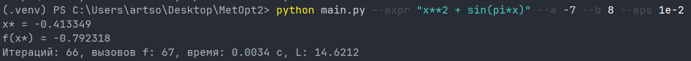
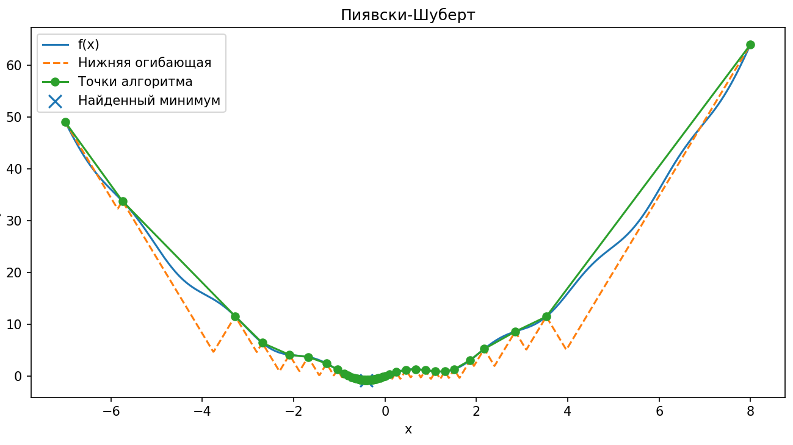

# Задание № 2. Метод ломаных

**Выполнил:**  
Ф.И.О: Соболев Артём Анатольевич  
Поток: МЕТОПТ 1.1

---

## Постановка задания

Разработать программу на языке Python, которая будет решать задачу поиска глобального экстремума для заданной функции на заданном отрезке.  
На вход программа принимает строку одномерной функции, например `f(x) = x + sin(3.14159*x)`, координаты концов отрезка, точность вычисления `eps`. На выходе она выполняет визуализацию графика исходной функции, вспомогательных функций, приближенное значение аргумента и минимального значения функции, число пробовавшихся итераций, потраченное время.

---

## Реализация

### Псевдокод

**1. Парсинг выражения** 

```
# Преобразует строку в выражение
Функция parse_function(expr):
    Преобразовать строку expr в корректный синтаксис
    Для каждого оператора или переменной:
        Если переменная или функция не разрешена:
            Вывести ошибку "Недопустимое имя в выражении"
    Возвращаем функцию f(x), которая вычисляет значение выражения для любого x
```

**2. Создание класса с основной логикой вычисления**

```
Класс PiyavskiiShubert:
    Инициализация(L=None, r=1.2):
        Устанавливаем L (константа Липшица)
        Устанавливаем r (коэффициент запаса)
    
    # Вычисление характеристики интервала [xi, xj]
    Метод _characteristic(xi, fi, xj, fj, L):
        R = 0.5 * (fi + fj) - 0.5 * L * (xj - xi)
        Возвращаем R

    # Вычисление точки Шуберта
    Метод _candidate_point(xi, fi, xj, fj, L):
        x_new = 0.5 * (xi + xj) - 0.5 * (fj - fi) / L
        Ограничиваем x_new между xi и xj
        Возвращаем x_new
    
    # Оценка Липшица на основе текущих точек
    Метод _inflate_L(xs, fs, r):
        Сортируем xs и fs
        Вычисляем максимальную разницу в значениях функции
        Оцениваем L = максимальная разница * r
        Возвращаем L

    Метод minimize(f, a, b, eps=1e-3, max_iters=2000):
        Инициализация: 
            Список точек xs = [a, b], значения функции fs = [f(a), f(b)]
            Начинаем с 2 вычислений функции (evals = 2)
            Если L не задан, вычисляем его адаптивно

        Пока it < max_iters:
            Сортируем точки xs и значения fs
            Для каждой пары соседних точек (xi, fi) и (xj, fj):
                Вычисляем характеристику R через _characteristic
                Если R минимальна:
                    Находим новую точку x_new через _candidate_point
                    Вычисляем значение функции f_new = f(x_new)
                    Добавляем x_new в список xs и f_new в список fs
                    Увеличиваем evals
                    Если f_new < f_best, обновляем лучший минимум
            Если разница между соседними точками <= eps, завершить итерации

        Возвращаем результат с минимальной точкой (x_min), значением функции (f_min), количеством итераций (iters), вычислений (evals)
```

**3. Создание графика**

```
Функция plot_result(f, a, b, result, title):
    Создаем сетку точек grid от a до b
    Вычисляем значения функции на этой сетке f_vals = f(grid)

    Сортируем xs и fs из результата
    Строим график функции f
    Строим график нижней огибающей, используя вычисления через L
    Отображаем точки xs и fs
    Отображаем точку минимума (x_min, f_min)
    Добавляем подписи и легенду на график
    Показываем график
```

**4. Запуск программы**

```
Функция run_optimizer_from_string(expr, a, b, eps, L, max_iters, r, title):
    Парсим строку expr в callable функцию f через parse_function.
    Создаем объект PiyavskiiShubert с параметрами L и r.
    Запускаем метод minimize(f, a, b, eps, max_iters).
    Строим график результата через plot_result.
    Выводим результаты минимизации: x_min, f_min, количество итераций и вызовов функции, время работы.
    Возвращаем результат минимизации.

Функция _demo(which):
    Если which == "rastrigin":
        Запускаем run_optimizer_from_string с функцией Растригина на заданном интервале
    Если which == "ackley":
        Запускаем run_optimizer_from_string с функцией Акли на заданном интервале

Основная программа:
    Читаем аргументы командной строки.
    Если задан --demo:
        Вызываем _demo с аргументом demo.
    Если задан --expr:
        Вызываем run_optimizer_from_string с переданными аргументами (expr, a, b, eps, L, r, max_iters, title).
    Завершаем программу.
```

## Демонстрация

**Установка зависимостей**

```bash
pip install -r requirements.txt
```

### Функция Растригина

**Запуск командой**

```bash
python main.py - -demo rastrigin --a -4 --b 4 --eps 1e-4
```

где:
- `--demo rastrigin`: запуск готовой тестовой функции  
- `--a -4`: левая граница = -4  
- `--b 4`: правая граница = 4  
- `--eps 1e-4`: точность вычисления (0,0001)


**Вывод:**
- x* = 0  
- f(x*) = 0  
- Итераций 64  
- Вызовов f 65  
- Время 0.0031с  
- L = 69.2233


### Функция Экли

**Запуск командой**

```bash
python main.py - -demo ackley --a -4 --b 4 --eps 1e-2
```

где:
- `--demo ackley`: запуск готовой тестовой функции  
- `--a -4`: левая граница = -4  
- `--b 4`: правая граница = 4  
- `--eps 5e-3`: точность вычисления (0,01)


**Вывод:**
- x* = 0  
- f(x*) = 4.44089e-16  
- Итераций 27  
- Вызовов f 28  
- Время 0.0012с  
- L = 14.2686


### Своя функция

**Запуск командой**

```bash
 python main.py --expr "x**2 + sin(pi*x)" --a -7 --b 8 --eps 1e-2
```

где:
- `--expr "x**2 + sin(pi*x)`: запуск своей функции
- `--a -7`: левая граница = -7  
- `--b 8`: правая граница = 8 
- `--eps 1e-2`: точность вычисления (0,01)



**Вывод:**
- x* = -0.41
- f(x*) = -0.79 
- Итераций 66  
- Вызовов f 67  
- Время 0.0034с  
- L = 14.6212



## Вывод

Реализован глобальный поиск минимума липшицевой функции на отрезке a,b методом Пиявского–Шуберта