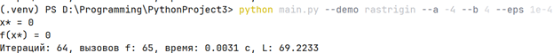
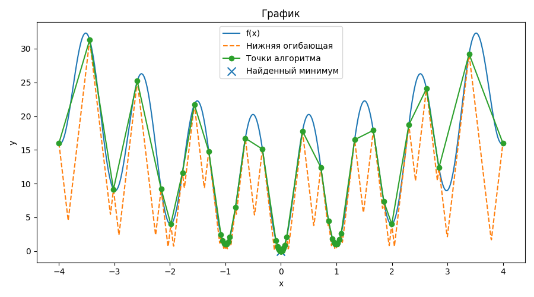
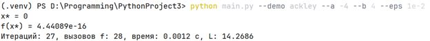
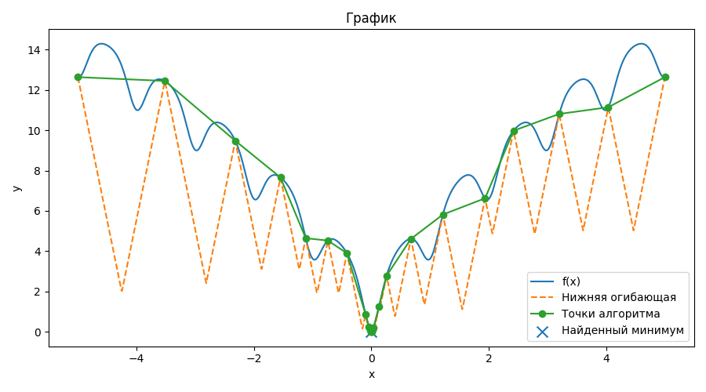

# Задание № 2. Метод ломаных

**Выполнил:**  
Ф.И.О: Соболев Артём Анатольевич  
**Поток:** МЕТОПТ 1.1

---

## Постановка задания

Разработать программу на языке Python, которая будет решать задачу поиска глобального экстремума для заданной функции на заданном отрезке.  
На вход программа принимает строку одномерной функции, например `f(x) = x + sin(3.14159*x)`, координаты концов отрезка, точность вычисления `eps`. На выходе она выполняет визуализацию графика исходной функции, вспомогательных функций, приближенное значение аргумента и минимального значения функции, число пробовавшихся итераций, потраченное время.

---

## Реализация

### Функция Растригина

**Установка зависимостей**

```bash
pip install -r requirements.txt
```

**Запуск командой**

```bash
python main.py - -demo rastrigin --a -4 --b 4 --eps 1e-4
```

где:
- `--demo rastrigin`: запуск готовой тестовой функции  
- `--a -4`: левая граница = -4  
- `--b 4`: правая граница = 4  
- `--eps 1e-4`: точность вычисления (0,0001)



**Вывод:**
- x* = 0  
- f(x*) = 0  
- Итераций 64  
- Вызовов f 65  
- Время 0.0031с  
- L = 69.2233



---

### Функция Экли

**Установка зависимостей**

```bash
pip install -r requirements.txt
```

**Запуск командой**

```bash
python main.py - -demo ackley --a -4 --b 4 --eps 1e-2
```

где:
- `--demo ackley`: запуск готовой тестовой функции  
- `--a -4`: левая граница = -4  
- `--b 4`: правая граница = 4  
- `--eps 5e-3`: точность вычисления (0,01)



**Вывод:**
- x* = 0  
- f(x*) = 4.44089e-16  
- Итераций 27  
- Вызовов f 28  
- Время 0.0012с  
- L = 14.2686



## Вывод

Реализован глобальный поиск минимума липшицевой функции на отрезке a,b методом Пиявского–Шуберта